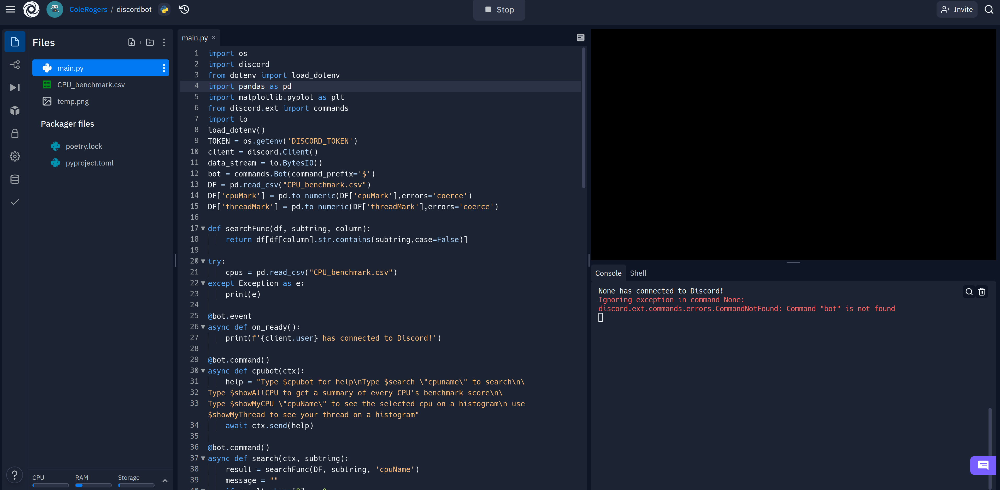

## Discord Bot

This bot uses a CPU benchmarks dataset from Kaggle
https://www.kaggle.com/datasets/alanjo/cpu-benchmarks

Which contains benchmark scores of most CPUs

The bot has three commands:

* It can search CPUs using the "$search" command
* It can plot a histogram of all CPUs in the dataset using $showallCPU command

* It can plot threads using the $showMy command

Plots are generated using matplotlib and pandas
Search is doen entitrely using pandas filtering.

This bot is hosted on Repl.it

